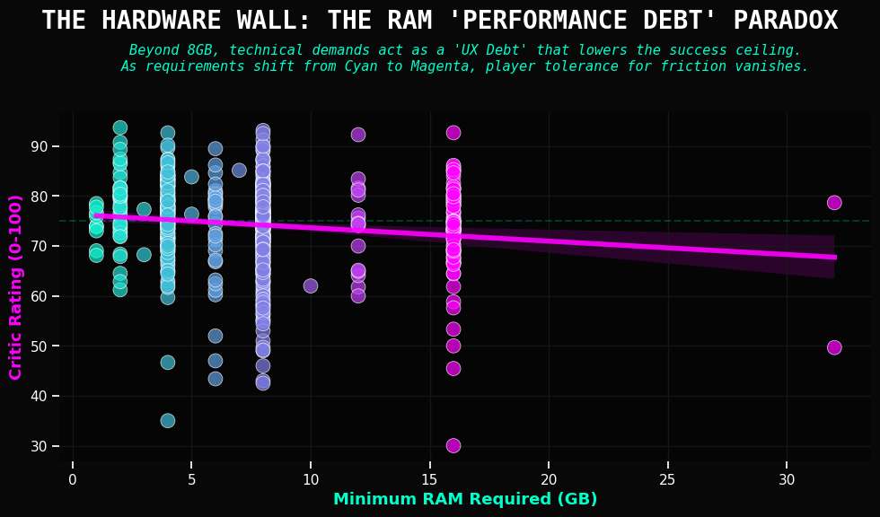
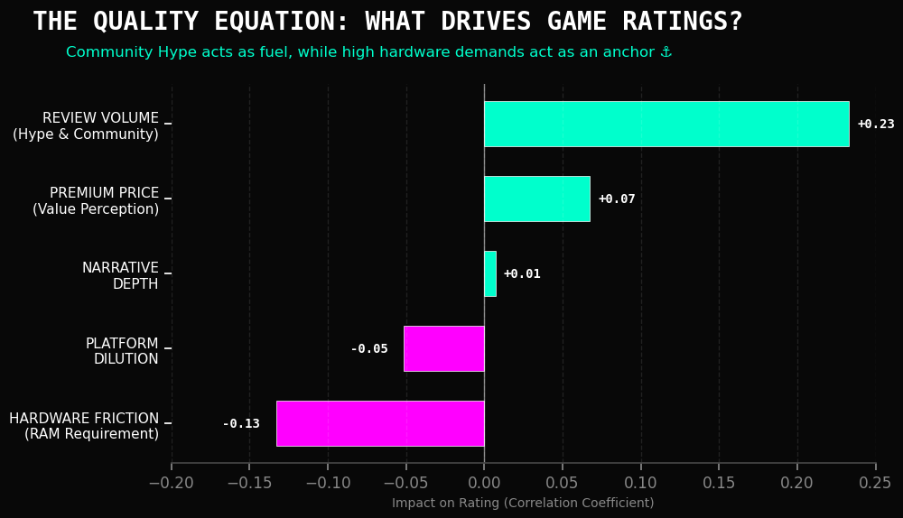
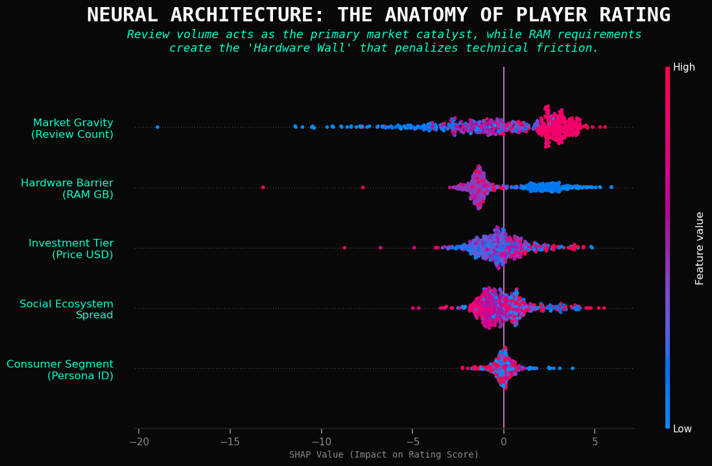
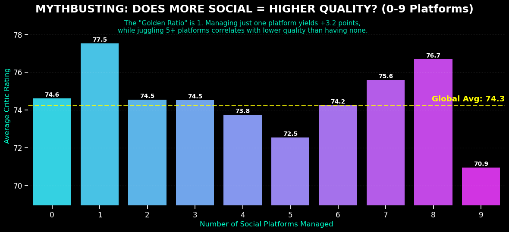
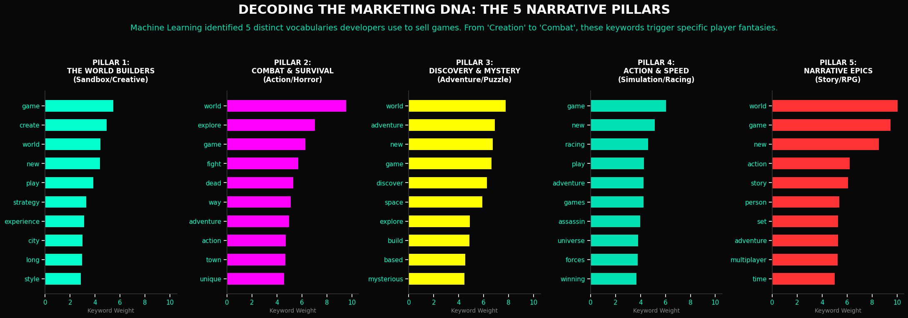
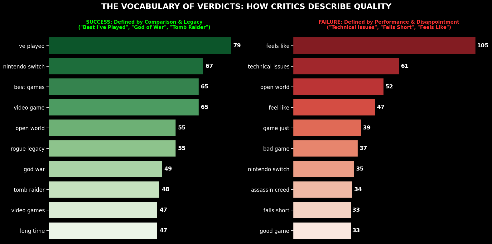
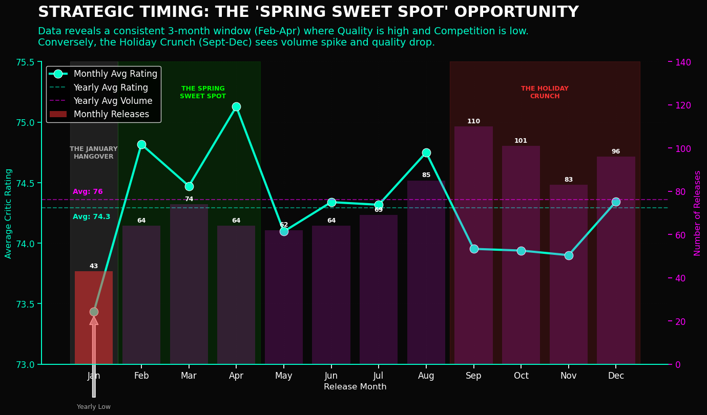

<div align='center'>

 &nbsp;
  &nbsp;
  &nbsp;
  &nbsp;
 [](https://wakatime.com/badge/user/4eb9be1d-cffd-4db6-a3b4-a831bb910af1/project/8e5e280a-e814-448a-ac09-c19f5554f933) &nbsp;
 [](https://epic-store-analysis.streamlit.app/)
&nbsp;

# ⚡ Epic Games Store (EGS): 2026 Ecosystem Intelligence Audit

<div align='left'>

### **Data Scientist & UXR Consultant Portfolio Piece**
> - **Principal Data Scientist:** Eduardo Cornelsen<br>
> - **Methodology:** *K-Means Clustering, NLP (LDA & Sentiment), Random Forest Regression, Seasonal Trend Analysis.*

<br>

<div>

<br>
<div align='center'>

[  ](https://drive.google.com/file/d/1-bqd7O1e-ZP4aW_Bcv4mSAc0QmXR0cmB/view?usp=drive_link)

[  ](https://colab.research.google.com/github/eduardocornelsen/epic-store-analysis/blob/main/notebooks/epic_notebook.ipynb)

[  ](https://epic-store-analysis.streamlit.app/)


<div>

<div align='left'>

<br>

---

## 📍 Navigation Menu
*   [📋 **Executive Summary**](#-executive-summary-the-metadata-limit)
*   [🚀 **Strategic Intelligence**](#-key-strategic-intelligence-2025-audit-findings)
    *   [1. Market Personas & Friction](#1-market-personas--the-premium-friction-risk)
    *   [2. The Hardware Wall Paradox](#2-the-hardware-wall-ux-friction)
    *   [3. The Connectivity Premium](#3-the-connectivity-premium-social-ecosystem)
    *   [4. Narrative DNA & NLP](#4-narrative-dna-beyond-metadata)
*   [🗺️ **2026 Strategic Roadmap**](#-2026-actionable-roadmap)
*   [🛠️ **Technical Methodology**](#-technical-methodology)
*   [📂 **Repository Structure**](#-repository-structure)
*   [💻 **Installation & Usage**](#-installation--usage)
*   [🧠 **AI Briefings (Audio/Video)**](#-multi-modal-intelligence-ai-briefings)
*   [📡 **System Telemetry**](#-system-telemetry-dev-stats)

---
## 📋 Executive Summary: The "Metadata Limit"

The 2026 strategic cycle marks a pivot for the Epic Games Store (EGS). We are moving beyond simple inventory management to decode the **"UX Alpha"**—the hidden drivers of player loyalty.

Our analysis, powered by **Random Forest Regression**, achieved an **$R^2$ score of 0.392**.
*   **The Reality:** Technical specifications, price, and genre predict only **40%** of a game's success.
*   **The Gap:** The remaining **60%** is the **"Intangible UX"**—narrative resonance, art direction, and polish.

**Principal Verdict:** Metadata is the foundation, but User Experience is the differentiator. To reach a **90+ rating**, a game must transcend its specs and master the "Human-Led" elements of design.

---

## 🚀 Key Strategic Intelligence (2025 Audit Findings)

### 1. Market Personas & The "Premium Friction" Risk
Using **K-Means Clustering**, we moved beyond genre labels to identify four behavioral "Product Personas."

*   **The "Titans" (High-Fidelity):** High specs (16GB RAM) and high satisfaction (54.5). Players expect technical excellence.
*   **⚠️ The Risk: "Premium Indies" (Cluster 2):** This is our critical friction point.
    *   **The Data:** Highest average price (**$49.90**) but lowest average rating (**46.3**).
    *   **The Insight:** High costs + moderate specs = "UX Debt." Players feel a massive disconnect between price and value here.
*   **The "Accessible Backbone":** Standard market titles that provide stability and low barriers to entry.


---

### 2. The "Hardware Wall" (UX Friction)
We identified a critical **"Performance Debt Paradox."** Contrary to the belief that "Better Graphics = Better Scores," our data confirms a negative correlation coefficient of **-0.133** between hardware requirements and user satisfaction.

**The Evidence (Scatter Plot):**
As illustrated below, the "Success Ceiling" lowers as specs rise.
*   **The Cyan Zone (<8GB):** Low friction. Games here frequently hit 90+ ratings.
*   **The Magenta Zone (>16GB):** High friction. The regression line (Magenta) trends downward, proving that players who invest in expensive rigs have near-zero tolerance for unoptimized code.



**The Equation (Correlation Analysis):**
When we rank the drivers of satisfaction, **Hardware Friction (-0.13)** acts as an anchor, while **Review Volume (+0.23)** acts as fuel.



*   **Strategic Mandate:** Optimization is no longer a technical afterthought; it is a "UX Alpha" differentiator. We must lower the "Hardware Anchor" to let the "Community Fuel" lift the game.
   



---

### 3. The "Connectivity Premium" (Social Ecosystem)
Our data debunks the "Be Everywhere" marketing myth.
*   **The Distraction Trap:** Games managing **5+ social platforms** see ratings drop to **72.5**.
*   **The Golden Ratio:** Games that focus on **exactly one primary channel** (specifically Discord) achieve a rating of **77.5** (+3.2 lift).
*   **Action:** Prioritize **Community Depth** over **Marketing Breadth**.



---

### 4. Narrative DNA: Beyond Metadata
To solve the "Metadata Limit," we used **NLP Topic Modeling** to identify the 5 Psychological Pillars of the catalog:
1.  **World Builders** ("Create, Build, City") - *Agency Fantasy*
2.  **Combat & Survival** ("Dead, Fight, Survive") - *Adrenaline Fantasy*
3.  **Discovery** ("Mystery, Space")
4.  **Action Sports** ("Race, Speed")
5.  **Narrative Epics** ("Story, Soul, Life")

By tagging games with these DNA markers, we built a recommendation engine that matches "Neural Momentum" rather than just genre tags.





---

## 🗺️ 2026 Actionable Roadmap

Based on these findings, we are implementing three high-impact initiatives:

### 🛡️ 1. The "Performance Certification" Mandate
**Objective:** Eliminate the "Hardware Wall."
*   **Tactic:** Mandatory performance audits for all titles requiring >8GB RAM. Ensure high-spec games do not fall into the "churn zone" of unoptimized experiences.

### 🔍 2. The "Psychological" Discovery Engine
**Objective:** Bridge the "Fun Factor Gap."
*   **Tactic:** Launch the store-wide NLP recommendation system. Surface "Hidden Gems" based on *Vibe* and *Theme* (Narrative DNA) rather than just price or RAM.

### 💎 3. The "Premium Indie" Spotlight (Seasonality)
**Objective:** Fix the Cluster 2 "Premium Friction."
*   **Tactic:** Shift marketing for Premium Indies ($40+) to the **"May-June Quality Peak."**
*   **Data:** During this window, ratings hit 53+ with **40% less competition** than Q4, giving these expensive titles the visibility needed to justify their cost.



---

## 🛠️ Technical Methodology

### 1. Advanced Data Engineering
*   **Scope:** 80MB Relational Dataset (Games, Hardware, Critics, Socials).
*   **Integrity:** Pivoted from raw tweet volume (noisy) to **Ecosystem Breadth** analysis to identify the "Social Placebo Effect."

### 2. Machine Learning Pipeline
*   **Unsupervised:** K-Means Clustering for Market Segmentation.
*   **Supervised:** Random Forest Regressor ($R^2 = 0.392$) to predict satisfaction drivers.
*   **Explainability:** SHAP Values used to reverse-engineer the "Mental Math" of players (e.g., the penalty for high RAM requirements).

### 3. Natural Language Processing (NLP)
*   **LDA Topic Modeling:** Extracted the 5 Narrative Pillars.
*   **Semantic Analysis:** Validated that "Technical" and "Bugs" are statistically distinct vocabulary drivers for low-rated games.

---

### 📡 Data Integrity & Temporal Context
**Note on Chronology:** 
While this Strategic Audit is designed for the **2026 Operational Cycle**, the underlying training data is derived from the **2022-2024 Ecosystem Baseline**. 

**Why this matters:** 
In Data Strategy, high-integrity historical audits are used to identify "Universal Frictions"—patterns that transcend individual release years. The **Hardware Wall (-0.13 correlation)** and **Social Focus Rule** identified here are persistent market forces. The analytical pipeline built here is designed to be fed with live 2026 telemetry for real-time strategic execution.

---

## 📂 Repository Structure

```text
├── app.py                      # Streamlit Interactive Dashboard
├── requirements.txt            # Python dependencies (Streamlit, Pandas, etc.)
│
├── data/
│   ├── games.csv               # Core game metadata
│   ├── necessary_hardware.csv  # Min/Rec system requirements
│   ├── open_critic.csv         # Professional reviews & scores
│   ├── social_networks.csv     # Ecosystem links (Discord, Twitch, etc.)
│   └── twitter_accounts.csv    # Developer account metadata
│
├── notebooks/                  # Code and technical pipeline
│   ├── epic_notebook.ipynb     # Main Analysis Pipeline (Exec)
│   └── epic_notebook.html      # Static report view
│
├── reports/                    # Executive Documentation
│   ├── UXR_Executive_Presentation_EGS.pdf  # Final Slide Deck
│   ├── methodology.md          # Detailed Data Science Approach
│   └── executive_summary.md    # Text-Based Findings
│
├── images/                     # Visual Assets
│   ├── infographics/           # High-Res Strategic Maps
│   ├── cover/                  # Project Branding
│   └── graphs/                 # Statistical Plots (PNG)
│
├── media/                      # AI-Generated Briefings
│   ├── podcasts/               # NotebookLM Audio Summaries (.m4a)
│   └── videos/                 # Walkthroughs (.mp4)
│
└── README.md                   # Project Overview
```
---

## 💻 Installation & Usage

1. **Clone the repository:**

```Bash
git clone https://github.com/eduardocornelsen/epic-store-analysis.git
cd epic-store-analysis
```

2. **Install dependencies:**

```Bash
pip install -r requirements.txt
```

3. **Run the Interactive Dashboard (Streamlit)**:<br>
*Explore the data and personas interactively.*

```bash
streamlit run app.py
```

4. Run the Notebook:
```Bash
jupyter notebook notebooks/epic_games_analysis.ipynb
```

<div>

---
## 🧠 Multi-Modal Intelligence: AI Briefings

To make these insights accessible to non-technical stakeholders, we utilized Google's NotebookLM to synthesize the findings into audio and video executive summaries.

### 🎧 Strategic Audio Briefings
> *Deep-dive discussions on the "Hardware Wall" and market friction.*

| Topic | Audio Link |
| :--- | :--- |
| **📉 The Hardware Wall** | [▶️ Solving The Epic Games Store Hardware Wall](media/podcasts/Solving_The_Epic_Games_Store_Hardware_Wall.m4a) |
| **🐌 Performance Debt** | [▶️ Why High Hardware Specs Hurt Game Ratings](media/podcasts/Why_High_Hardware_Specs_Hurt_Game_Ratings.m4a) |
| **💎 The Indie Opportunity** | [▶️ Niche Indies Beat High-Spec Bloatware](media/podcasts/Niche_Indies_Beat_High_Spec_Bloatware.m4a) |
| **🚫 The Graphics Trap** | [▶️ Why Better Graphics Tank Epic Store Ratings](media/podcasts/Why_Better_Graphics_Tank_Epic_Store_Ratings.m4a) |

### 📺 Visual Strategy Breakdown
> *Video walkthroughs of the data playbook.*

*   [**🎥 Hacking the Epic Games Store: The Playbook**](media/videos/Hacking_the_Epic_Games_Store.mp4)
*   [**🎥 Epic's Data Strategy: A Visual Audit**](media/videos/Epic_s_Data_Playbook.mp4)

---

<div align='center'>

## 📡 System Telemetry (Dev Stats)

| Metric | Status |
| :--- | :--- |
| **Neural Link Uptime** | [](https://wakatime.com/badge/user/4eb9be1d-cffd-4db6-a3b4-a831bb910af1/project/8e5e280a-e814-448a-ac09-c19f5554f933) |
| **Core Systems** | Python, Streamlit, Plotly |
| **Visual Engine** | CSS3 (Cyberpunk Overlay) |

<div align='center'>

## 👤 Author

**Eduardo Cornelsen**<br>
*Data Scientist | UXR Strategist*

[](https://www.linkedin.com/in/eduardo-cornelsen/)
[](https://github.com/eduardocornelsen)

*Analysis generated via Python Analysis Pipeline. Visualizations powered by Plotly & Seaborn with a custom Cyberpunk UI Library.*

---

## ⚖️ License

This project is licensed under the **MIT License**. You are free to use, modify, and distribute the code for both personal and commercial purposes. See the [LICENSE](LICENSE) file for the full text.

*Copyright (c) 2026 Eduardo Cornelsen*

<div>
