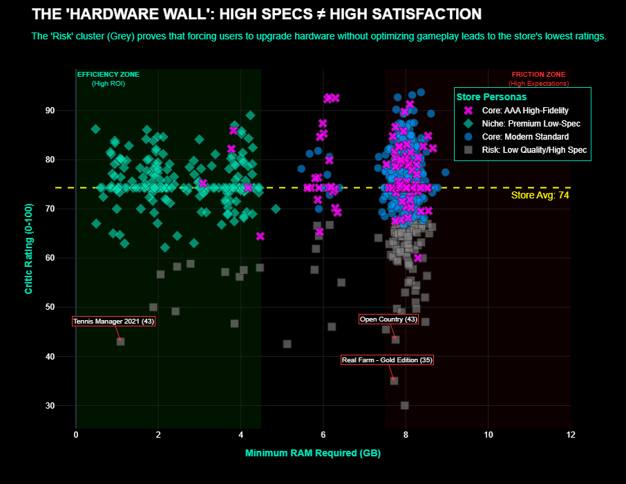
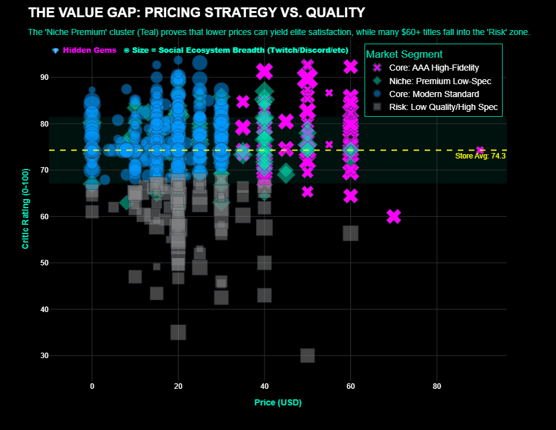
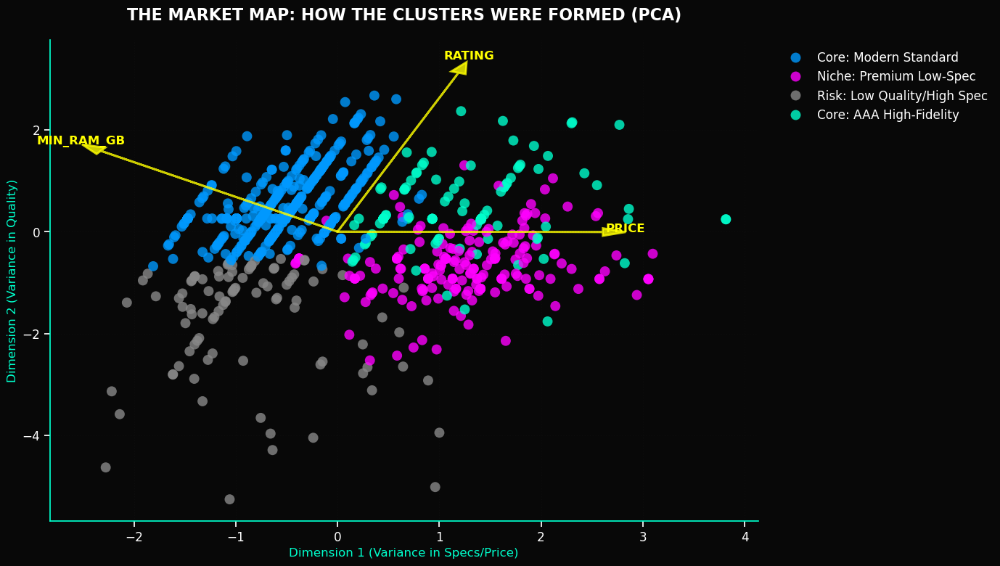
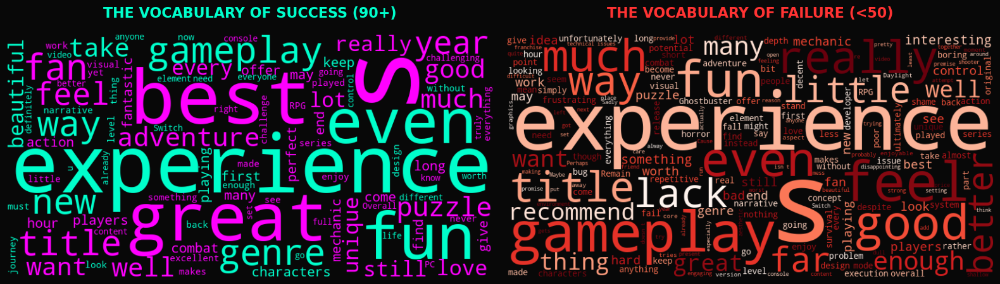
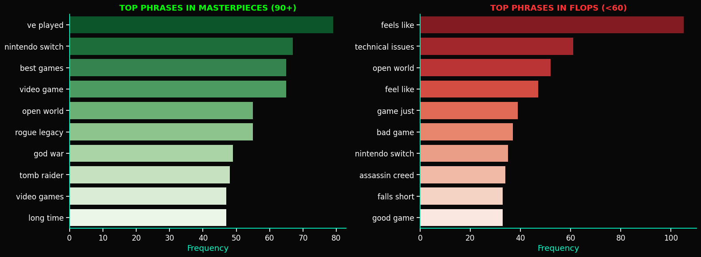
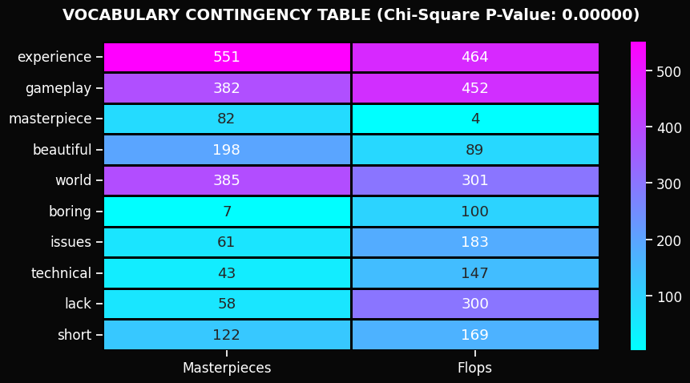

# ⚡ EGS Ecosystem Intelligence: Strategic Market Audit (2025)

   


> **Principal Data Scientist & UXR Consultant Portfolio Piece**  
> *Bridging the gap between raw metadata and actionable product strategy for the Epic Games Store.*


<div align='center'>

[  ](reports/UXR_Executive_Presentation_EGS.pdf)
[  ](notebooks/epic_notebook.ipynb)

<div>

---

<div align='left'>

## 🌐 Project Context
As the digital storefront landscape becomes increasingly competitive, understanding the interplay between **Technical Requirements**, **Pricing Strategy**, and **Critic Sentiment** is vital. 

This project performs a multi-dimensional audit of the Epic Games Store (EGS) catalog to identify:
1.  **UX Friction Points:** Where hardware requirements negatively impact player satisfaction.
2.  **Revenue Opportunities:** Identifying "Hidden Gem" segments that maximize ROI.
3.  **Strategic Timing:** Analyzing the impact of "Holiday Crunch" on game quality.

---

## 🚀 Key Strategic Insights

### 1. The "Hardware Wall" (UX Friction)
We identified a critical failure point at the **8GB RAM threshold**. High-spec games with ratings below 60/100 create a "churn zone" where players invest in hardware but receive poor optimization.


* **Action:** Implement a **"Performance Certification"** badge for high-spec titles to reduce refund rates.

### 2. The "Niche Premium" Opportunity
Using K-Means Clustering, we identified the most efficient market segment: **Cluster 3 (Premium Low-Spec)**. These titles command high prices (~$26) despite low hardware requirements (<3GB RAM) and maintain elite ratings (75+).


* **Action:** Modify the Store Algorithm to boost visibility for "Premium Indie" titles.

### 3. The "Holiday Quality Trap" (Seasonality)
Temporal analysis reveals a significant **Quality Gap** during the Q4 holiday rush. While release volume peaks in Oct/Nov, average ratings take an aggressive dive.
* **Insight:** **April** emerges as a "Masterpiece Window" with high ratings and low competition.
* **Action:** Advise high-potential partners to target **Q2 Releases** to avoid the Q4 noise.


---

## 🛠️ Technical Methodology

This project utilized a full-stack Data Science pipeline:

### 1. Advanced Data Engineering
*   **Pipeline:** Robust cross-table merging of an 80MB relational dataset (Games, Hardware, Critics, Socials).
*   **Integrity Audit:** Detected critical flaws in the source Twitter data (generic account linkage). Pivoted strategy to analyze **Ecosystem Breadth** (Platform Counts) instead of raw volume, saving the analysis from false conclusions.

### 2. Machine Learning (Unsupervised & Supervised)
*   **K-Means Clustering:** Segmented the store into 4 distinct "Product Personas" (Risk, Modern Standard, AAA, Niche Premium).
*   **Random Forest Regression:** Achieved an **$R^2$ of 0.392**, proving that ~40% of a game's success is tied to metadata (Price/Specs), while 60% remains tied to intangible UX factors.
  



### 3. NLP & Semantic Analysis
*   **LDA Topic Modeling:** Extracted 5 "Narrative Marketing Pillars" from game descriptions.
*   **Hypothesis Testing:** Used Chi-Square tests to prove that Top Critics use a statistically distinct vocabulary ("Technical", "Bugs") when reviewing low-rated games.



<br>



<br>



---

## 📂 Repository Structure

```text
├── data/
│   ├── games.csv               # Core game metadata
│   ├── necessary_hardware.csv  # Min/Rec system requirements
│   ├── open_critic.csv         # Professional reviews & scores
│   ├── social_networks.csv     # Ecosystem links (Discord, Twitch, etc.)
│   ├── tweets.csv              # Raw tweet data (unused due to quality issues)
│   └── twitter_accounts.csv    # Developer account metadata
│
├── notebooks/                  # Code and technical pipeline
│   ├── epic_notebook.html      # Static report view
│   ├── epic_notebook.ipynb     # The Main Analysis Pipeline (Exec)
│   └── epic-notebook.pdf       # Printable executive brief
│
├── reports/                    # Presentation slides
│   └── UXR_Executive_Presentation_EGS.pdf  # UXR Presentation
│
├── portfolio_assets/           # Project branding & cover images
│
├── images/                     # Exported visualizations for README
├── requirements.txt            # Python dependencies
├── LICENSE                     # MIT License
└── README.md                   # Project documentation

```

---

## 💻 Installation & Usage

1. Clone the repository:

```Bash
git clone https://github.com/eduardocornelsen/epic-store-analysis.git
cd epic-store-analysis
```

2. Install dependencies:

```Bash
pip install -r requirements.txt
```

3. Run the Notebook:
```Bash
jupyter notebook notebooks/epic_games_analysis.ipynb
```

<div>

---
<div align='center'>

## 👤 Author

**Eduardo Cornelsen**<br>
*Data Scientist | UXR Strategist*

[](https://www.linkedin.com/in/eduardo-cornelsen/)
[](https://github.com/eduardocornelsen)

*Analysis generated via Python Analysis Pipeline. Visualizations powered by Plotly & Seaborn with a custom Cyberpunk UI Library.*

---

## ⚖️ License

This project is licensed under the **MIT License**. You are free to use, modify, and distribute the code for both personal and commercial purposes. See the [LICENSE](LICENSE) file for the full text.

*Copyright (c) 2026 Eduardo Cornelsen*

<div>